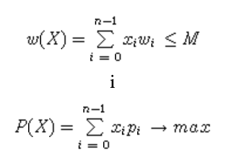
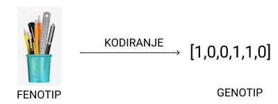
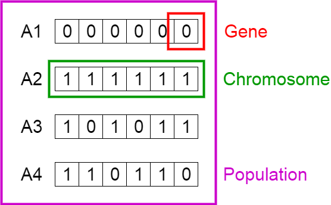
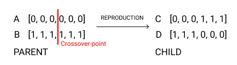
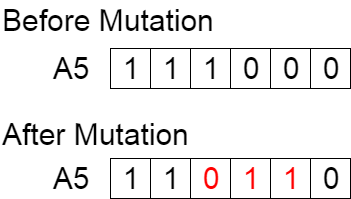
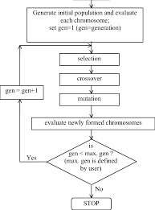
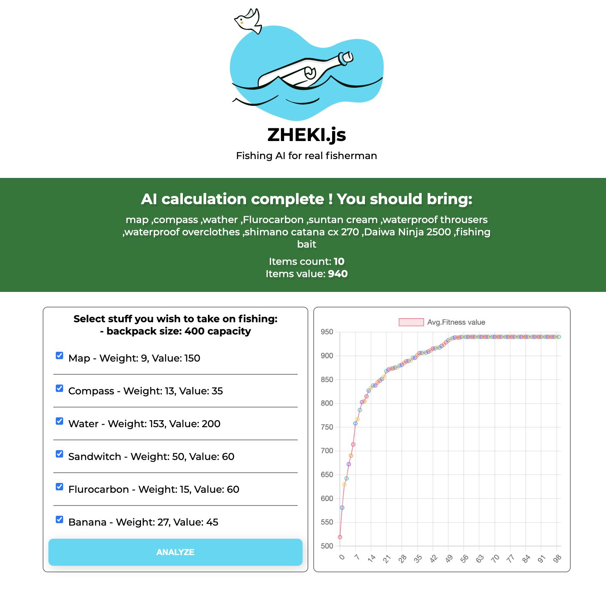

# LV 2 zadatak - ZHEKI.js - Fishing AI

### Heroku LINK: 

<hr/>

### 1. Opis zadatka

*Zheki i Lule strastveni su ribolovci. Svaki put kada idu na pecanje pretovare Zhekijevog Golfa jer se ne mogu odlučit što im je od ribolovne opreme važno, a što nije. Kako bi riješili navedeni problem, Lule se sjetio da bi mogao napraviti web aplikaciju koja implementira genetski algoritam koji će pronaći riješenje za njihov kombinatorni problem. Na Youtube-u je našao par videa o genetskim algoritmima i krenuo je u implementaciju svoje ideje. U sljedećim smjernicama, prikazani su koraci kako je Lule krenio implementirati svoj zadatak:*

1. Sastavio je listu stvari koji nosi na pecanje i svakoj stvari je pridružio određenu vrijednosti i određenu broj koji predstavlja težinu koliko bi potencijalno koji predmet zauzimao prostora unutar Golfova gepeka (pošto nije baš velik).

2. Kreirao je HTML sučelje i programirao je logiku za odabiranje elemenata iz navedene liste, kao i slanje tih istih podataka u ostale dijelove programskog koda putem JSON formata.

    Kada forma sa odabranim elementima se pošalje, prosljeđuje sljedeći JSON zapis:
    ```
    [
        {
            "name": "map",
            "weight": 9,
            "value": 150
        },
        {
            "name": "compass",
            "weight": 13,
            "value": 35
        },
    ]
    ```
    
3. Također, implementirao je potencijalne metode ```updateChart``` za prikaz prosječne funkcije dobrote pojedine generacije na grafu i grafičku metodu ```displayBestCombination``` koja prikazuje najbolju kombinaciju stvari koju je potrebno ponijeti na pecanje i njihovu ukupnu vrijednost.

Pošto je Lule frontendaš, krenuo je implementirati genetski algoritam u datoteci ```geneticAlgo.js```. Implementirao je klasu ```GA``` i njezin konstruktor koji predstavlja genetski algoritam. Međutim, zapeo je i ne zna kako bi dalje implementirao genetski algoritam, kao i komunikaciju s ostatkom programskog koda koje je dosada napravio. Pomozi Luletu da implementira svoju ideju do kraja i da riješe problem pretovarenog Golfa.


### 2. Zadatak

Iz navedenog opisa problema, moguće je definirati genetski algoritam s funkcijom dobrote opisanom sljedećim izrazom:

#### 2.1 Izraz
*Ako je dano N predmeta (y0,..., yn-1), svaki od njih s težinom W(i) i vrijednosti P(i) , i = 0,...n-1, potrebno je utvrditi koje je predmete moguće odabrati tako da suma njihovih težina ne prelazi zadani M, a da je njihova ukupna vrijednost P maksimalna. Tada je rješenje n-torka X = (x0,..., xn-1) {0,1}n, takva da je:*




#### 2.2 Shema Genetskog algoritma i implementacija

Unutar datoteke ```geneticAlgo.js``` i klase ```GA``` potrebno je implementirati genetski algoritam na sljedeći način:

1. Nadolazeći JSON objekt koji dolazi iz forme potrebno je enkodirati u binarnu reprezentaciju koja će vjerno predstavljati kombinaciju izabranih stvari s definiranom funkcijom dobrote na temelju odabranih stvari
   
2. Potrebno je kreirati metodu za stvaranje inicijalne populacije koja će se nalaziti u sljedećem formatu:
   
```
[   // Primjer jedne jedinke iz populacije
    {
        "generation": 0,
        "gene": [0,1,0,0,0,1,1,1,1,0,0,1],
        "fitness": 240
    },
    .....
    }
] 
```

3. Potrebno je metodu za selekciju potencijalnih roditelja - ***Turnirska selekcija*** (Pogledaj dodatak 2 na kraju)
   
4. Potrebno je kreirati metodu za operator REKOMBINACIJE (križanje) roditelja - ***Križanje u jednoj točki*** (Pogledaj dodatak 3 na kraju) - Vjerojatnost pojave križanja je ***75%*** (potrebno implementirati)
   
5. Potrebno je kreirati metodu za operator MUTACIJE novog kreiranog genetskog materijala - ***Bitflip Mutacija*** (Pogledaj dodatak 4 na kraju) - Vjerojatnost pojave mutacije je ***10%*** (potrebno implementirati)
   
6. Potrebno je kreirati metodu za odabir nove populacije - metoda ***MI+ALFA*** (Pogledaj dodatak 5 na kraju)

Nakon implementacije genetskog algoritma, potrebno je unutar implementirane logike pozvati i prosljediti parametre metodama ```updateChart``` za prikaz vrijednosti na grafu i  ```displayBestCombination``` za prikaz najbolje kombinacije koju je dao genetski algoritam.

**Napomena**: Prilikom stvaranja inicijalne populacije i nakon kreiranja novog genetskog materijala koji će predstavljati novu populaciju, potrebno je raditi provjeru uvjeta funkcije gustoće. Ako je stvorena jedinka koja ima kombinaciju koja daje zbroj težine veće od one dopuštene, potrebno je takvu jedinku kazniti i postaviti joj funkciju gustoće na 0. Pomoću kažnjavanja smanjuje se  broj jedinki koje daju loše rješenja i time smanjujemo prijenos lošeg genetskog materijala u narednim generacijama.


**Napomena**: Navedeno rješenje potrebno je implementirati u datoteci ```geneticAlgo.js``` koristeći ES6 JavaScript sintaksu sa naglaskom objektnog orijentiranu paradigmu. Također potrebno je proučiti ostatak programskog koda, module, metode i njihove parametre kako bi što bolje shvatili navedeni zadatak.


***U Dodatku broj 6. prikazano je kako treba izgledati rješenje zadatka ako su odabrani svi elementi iz definirane forme.***


### 3. Potrebno je proučiti:

- Literaturu na sljedećem linku (Poglavlja 1,2 i 3): [Link](http://www.zemris.fer.hr/~golub/ga/ga_skripta1.pdf)

- Pogledati: https://www.youtube.com/watch?v=cxweR4i0ejA

- Pogledati: https://www.youtube.com/watch?v=L--IxUH4fac

- Pogledati: https://www.youtube.com/watch?v=uQj5UNhCPuo
  
- Priprema za LV2


### Genetski algoritam

#### Kodiranje problema u prostoru pretrage
    
Ne postoji jedan način za kreiranje genetskog algoritma; on nastaje kombinacijom različitih raspoloživih operatora tako da bude prikladan za rješavanje određenog optimizacijskog problema. Klasični genetski algoritam ima binarnu reprezentaciju, selekciju proporcionalnu podobnosti, nisku vjerojatnost mutacije, naglasak na genetski inspiriranoj rekombinaciji, i generacijski izbor kandidata koji će se prenijeti u sljedeću generaciju. Prvi korak u konstrukciji bilo kojeg evolucijskog algoritma je određivanje reprezentacije kandidata za rješenje. To uključuje definiciju genotipa te preslikavanja s genotipa u fenotip (prebacivanje iz prostora problema u prostor gdje se može raditi pretraga razumljiva računalu). Najčešće se koristi sljedeća reprezentacija:

- binarna reprezentacija: genotip prikazan kao string binarnih znamenki (Slika 1)



#### Inicijalna populacija

Proces započinje skupom pojedinaca koji se naziva populacija. Svaki je pojedinac potencijalno je rješenje problema optimizacije. Pojedinca karakterizira skup parametara (varijabli) koje nazivamo geni. Geni su spojeni u niz da bi se stvorio kromosom.



#### Funkcija dobrote

Funkcija dobrote određuje koliko je pojedinac sposoban da se natječe s ostalim sudionicima unutar populacije (drugim riječima funkcija dobrote predstavlja kvalitetu određenog rješenja). Vjerojatnost da će pojedinac biti odabran kao potencijalni roditelj za kreiranje novog genetskog materijala temelji se na vrijednosti funkcije dobrote.

#### Selekcija

U fazi selekcije odabiru se najsposobniji pojedinci (najčešće dva ili više) koji će stvoriti novi genetski materijal za sljedeću  generaciju. Dva para pojedinaca (ili više) odabiru se na temelju rezultata njihove funkcije dobrote. Pojedinci visoke kondicije imaju veće šanse da budu odabrani za reprodukciju.

- Selekcijske metode: Nasumični odabir, turnirska selekcija, rulet kolo.

#### Križanje

Križanje je najznačajnija faza u genetskom algoritmu. Za svaki par roditelja koji će se pariti, uzima se slučajna točka (ili više točaka) križanja unutar niza gena. Iz reprodukcije roditelja kreira se dvoje djece (ili više, ali najčešće dvoje) koja će predstavljati novi genetski materijal (nova rješenja) unutar nove populacije. Potomstvo se stvara razmjenom gena roditelja u određenoj točki križanja.



#### Mutacija

U određenom novom potomstvu, neki od gena novo kreirane djece mogu biti izloženi mutaciji s malom slučajnom vjerojatnošću. To podrazumijeva da se neki bitovi u bitnom nizu mogu preokrenuti. Mutacija se događa kako bi se održala raznolikost unutar populacije i spriječila prerana konvergencija.

- Primjer: Bitflip mutacija



#### Odabir najkvalitetnijih jedinki 

Nakon što se generiraju nove jedinke, koji trebaju predstavljati novu generaciju genetskog materijala, česti je slučaj da se stara i novo kreirana populacija spoji u jedan veliki niz, iz kojih se uzima N najboljih jedinki s najvećom vrijednosti funkcije dobrote. Te N najbolje jedinke (iz stare i nove populacije) predstavljaju novu generaciju populacije iz kojeg se opet selektiraju potencijalni roditelji koji imaju visoku funkciju dobrote za stvaranje novog i boljeg genetskog materijala.

Populacija ima fiksnu veličinu. Kako se formiraju nove generacije, jedinke s najmanjom funkcijom dobrote se  odbacuju, pružajući prostor za novo potomstvo. Ponavljanjem ovih gore navedeni koraka potiče se stvaranje novih pojedinaca u generaciji koji su bolji potencijalno bolji od prethodne generacije.

#### Kraj

Algoritam prestaje s radom ako je populacija konvergirala (ili je dosegnut maksimalni broj iteracija) (ne daje potomstvo koje se značajno razlikuje od prethodne generacije). U ovome trenutku možemo zaključit da je genetski algoritam pružio niz rješenja našeg optimizacijskog problema.


### 4. Dodatak:

#### 1. Pseudokod genetskog algoritma:

```
INICIJALIZIRAJ populaciju s nasumičnim kandidatima;
IZRAČUNAJ funkciju dobrote za svakog pojedinog kandidata:
while nije zadovoljen UVJET ZAUSTAVLJANJA do
    Odaberi roditelje;
    Izvrši KRIŽANJE roditelja i GENERIRAJ potomstvo;
    MUTIRAJ potomstvo;
    EVALUIRAJ novo potomstvo;
    ODABERI jedinke koje će se nalaziti u sljedećoj generaciji;
END
```


#### 2. Pseudokod za Turnirsku selekciju:

```
IZABERI K pojedinaca iz populacije N slučajnim odabirom;
IZABERI pojedinca K1 s najvećom vrijednosti P iz K pojedinaca;
IZABERI sljedećeg pojedinca K2 s najvećom vrijednosti P iz K pojedinaca;
AKO je K1 == K2 ponovi prijašnji korak;
VRATI K1, K2;
END
```

#### 3. Križanje u jednoj točki:
Ako vrijednost slučajne varijable R ima vrijednost manju od definirane vrijednosti za izvođenje operacije, operacija REKOMBINACIJE će se izvršiti, u suprotnom, geni djece će biti identični genima roditelja


#### 4. Pseudokod za bitflip mutaciju:
```
for element N u nizu M:
    generiraj random vrijednost R u rasponu [0-1];
    if R < N:
        AKO JE N=0:
            postavi N=1;
            KRAJ;
        AKO JE N=1;
            postavi N=0;
            KRAJ;
KRAJ;
```


#### 5. Pseudo kod za populaciju MI + ALFA:
```
UZMI staru populaciju N i novu populaciju M i spoji ih u niz NM;
SORTIRAJ niz NM prema funkciji dobrote P;
UZMI N najboljih iz niza NM i postavi ih u niz K;
VRATI niz K kao novu populaciju;
KRAJ;
```

#### 6. Rješenje zadatka

Ukoliko je genetski algoritam dobro implementiran, vrijednost funkcije dobrote može varirati između 900-1000 za sve odabrane elemente


